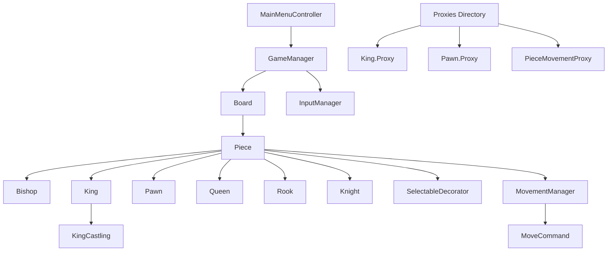

# Chess Game 

This repository contains a Unity-based frontend implementation for a chess game. It leverages object-oriented principles and various design patterns, including Singleton, Command, and Decorator, to provide scalable and maintainable gameplay logic.

## Overview

The Chess Game frontend, developed using Unity and C#, focuses on delivering a highly interactive and intuitive user experience for playing chess. It incorporates dynamic gameplay features such as piece movement validation, game state management, and special moves like castling. The architecture emphasizes modularity and scalability, employing design patterns like Singleton for global state management, Command for encapsulating piece movements, and Decorator for extending functionality dynamically. The project's goal is to provide a robust chess simulation adhering to standard chess rules while remaining adaptable for future enhancements, including additional gameplay modes or AI integration.

## Architecture Diagram

## Component Architecture

The application has a modular component hierarchy designed for maintainability and scalability. Key components include:

- **MainMenuController**: Handles navigation from the main menu to the game scene.
- **GameManager**: Centralized control of game state, turn-based logic, and victory conditions.
- **Board**: Provides a unified interface for tilemap and camera operations, enabling seamless world-to-cell coordinate conversion.
- **Pieces**: Abstract `Piece` class and its concrete subclasses (`Bishop`, `King`, `Pawn`, `Queen`, `Rook`, `Knight`) encapsulate individual chess piece behavior, including movement logic.
- **MovementManager**: Coordinates input detection and movement validation.
- **Proxies**: Implements restrictions/modifications to piece movements under specific rules (e.g., `King.Proxy` prevents illegal moves into checked squares).
- **Behavior Classes**: Enhance functionality dynamically, such as `SelectableDecorator` for selection handling and `MoveCommand` for encapsulating movements.

## State Management

State management is handled primarily through Singleton MonoBehaviour classes such as `GameManager`, `SelectedPiece`, and `Board`. These classes centralize global state tracking for game logic, selected pieces, and board properties. The `GameManager` class maintains high-level game states (`GameState` enum), including conditions like `Check` and `Checkmate`. State transitions are triggered by user inputs detected by `InputManager` and validated through the `MovementManager` logic. Data flows between components through method calls and shared references, ensuring synchronization across the application.

## Routing

The application utilizes Unity's Scene Management for routing. The `MainMenuController` handles navigation between the main menu and the game scene. Scenes are loaded asynchronously to ensure smooth transitions. This structure is suitable for the limited navigation requirements of the chess game but can be extended for future expansions such as multiple game modes or tutorials. Routes:

- **Main Menu**: Entry point for the application
- **Game Scene**: Contains the chessboard and gameplay logic

## Getting Started

Follow these steps to set up and run the frontend locally:

1. Clone the repository:
   
   git clone https://github.com/Ahtat204/ChessGame.git
   
2. Open Unity Hub and add the cloned project directory to the list of projects.
3. Install Unity Editor version matching the project's requirements (check `ProjectVersion.txt` in the root directory).
4. Open the project in Unity Editor.
5. Navigate to `Assets/Scenes/MainMenu.unity` and open the scene.
6. Play the game by clicking the 'Play' button in the Unity Editor toolbar.
7. Verify that the chessboard loads correctly and pieces are interactable.
8. Test player interactions such as piece selection and movement.
9. Debug any issues by reviewing the Unity Console for error logs.
10. Adjust game settings via `GameManager` properties in the Inspector.
11. Build the project for standalone platforms using the 'Build Settings' menu.
12. Run the built executable and confirm functionality matches the editor version.

Common troubleshooting tips:
- Ensure all dependencies (e.g., Unity Tilemap package) are installed.
- Verify the Unity Editor version is compatible with the project.
- Reimport assets if graphical issues occur.
