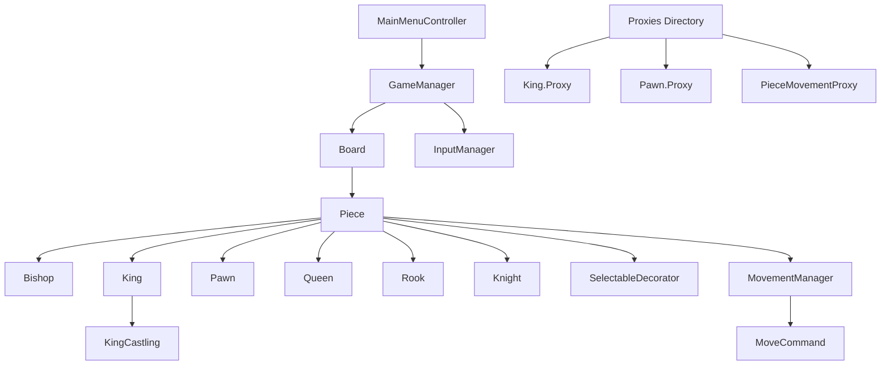
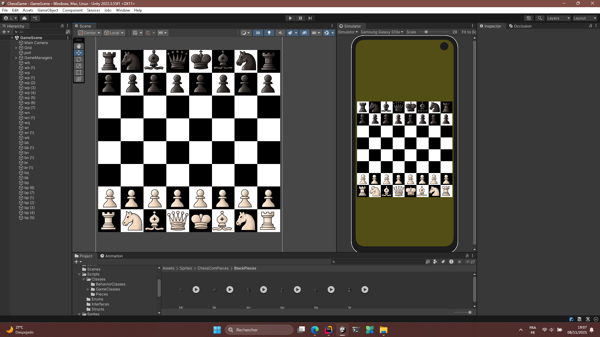

# Chess 

This repository contains a Unity-based  implementation for a chess game. It leverages object-oriented principles and various design patterns, including Singleton, Command, and Decorator, to provide scalable and maintainable gameplay logic.

## Overview

The Chess Game, developed using Unity and C#, focuses on delivering a highly interactive and intuitive user experience for playing chess. It incorporates dynamic gameplay features such as piece movement validation, game state management, and special moves like castling. The architecture emphasizes modularity and scalability, employing design patterns like Singleton for global state management, Command for encapsulating piece movements, and Decorator for extending functionality dynamically. The project's goal is to provide a robust chess simulation adhering to standard chess rules while remaining adaptable for future enhancements, including additional gameplay modes or AI integration.

## 📂 Core Scripts Directory Structure

The `Assets/Scripts` directory is organized into four main categories: `Classes`, `Enums`, `Interfaces`, and `Structs`.

```
└── Scripts/
    ├── SelectedPiece.cs
    ├── Classes/
    │   ├── PieceComponent/
    │   │   ├── KingCastling.cs
    │   │   ├── CommandManager.cs
    │   │   ├── PieceMovementComponent.cs
    │   │   └── PieceSelectionComponent.cs
    |   ├── Command/
    │   │   ├── AbstractPieceCommand.cs
    │   │   ├── CommandInvoker.cs
    │   │   ├── ConcreteMoveCommand.cs
    │   ├── GameClasses/
    │   │   ├── Board.cs
    │   │   ├── GameManager.cs
    │   │   ├── InputManager.cs
    │   │   ├── MainMenuController.cs
    │   │   └── Proxies/
    │   │       ├── King.Proxy.cs
    │   │       ├── Pawn.Proxy.cs
    │   │       └── PieceMovementProxy.cs
    │   ├── Pieces/
    │   │   ├── Bishop.cs
    │   │   ├── King.cs
    │   │   ├── Knight.cs
    │   │   ├── Pawn.cs
    │   │   ├── Queen.cs
    │   │   └── Rook.cs
    │   ├── Piece.cs
    │   └── UtilityClass.cs
    ├── Enums/
    │   ├── GameState.cs
    │   ├── MoveType.cs
    │   ├── PieceColor.cs
    │   └── SelectionStatus.cs
    ├── Interfaces/
    │   ├── ICapturable.cs
    │   ├── ICommand.cs
    │   ├── IPromotable.cs
    │   └── ISelectable.cs
    └── Structs/
        └── Coordinates.cs
```

-----

## Architecture Diagram



## 🛠️ Key Components & Design

### **Classes**

| File               | Description                                                                                                                                                                 |
|:-------------------|:----------------------------------------------------------------------------------------------------------------------------------------------------------------------------|
| `Piece.cs`         | **Abstract Base Class** for all chess pieces, defining essential properties like `PossibleMoves`, `Color`, and `Value`, and an abstract method for calculating legal moves. |
| `UtilityClass.cs`  | Provides static utility methods, such as a conditional `Mapper` for use to check the Player's turn.                                                                              |
| `SelectedPiece.cs` | A **Singleton** MonoBehaviour used to track the currently selected chess piece, acting as a global selector/detector.                                                       |

#### Behavior Classes

| File                     | Description                                                                                                                                                                                                     |
|:-------------------------|:----------------------------------------------------------------------------------------------------------------------------------------------------------------------------------------------------------------|
| `PieceMovementComponent.cs`     | Implements IMove and Handles the **piece's movement logic** and  capturing. It relies on the piece's `PossibleMoves` list and the GameManager Dictionnary                                                                             |
| `PieceSelectionComponent.cs` | Implements the `ISelectable` interface, handling **selection and deselection** logic for a piece, often decorated onto a `Piece` object.                                                                        |
| `MoveCommand.cs`         |  Implementing the `ICommand`, this class is designed to encapsulate a piece movement as a command, allowing for **undo/redo functionality** ( `Undo()` is currently not  implemented yet). |

#### Game Classes

| File                            | Description                                                                                                                                                |
|:--------------------------------|:-----------------------------------------------------------------------------------------------------------------------------------------------------------|
| `Board.cs`                      | A **Singleton** MonoBehaviour providing centralized access to the Unity `Tilemap` and the main `Camera`, simplifying world-to-cell coordinate conversions. |
| `GameManager.cs`                | Manages the **overall game state**, including player turns (`Turn`), game conditions (`GameState`), and tracking the pieces on the board.                  |
| `InputManager.cs`               | A **Singleton** class for centralizing input handling (e.g., mouse direction and position).                                                                |
| `MainMenuController.cs`         | Handles scene management logic, specifically for loading the main "GameScene" from the **Main Menu**.                                                      |
| `Validators/`                   | Directory for classes implementing Move Validation Like path  ** to restrict or modify piece movement under special game rules.                            |
| `PieceMovementValidator.cs`     | Path Validation for Bishop , Rook and Queen to prevent Penetration.
                |

#### Piece Subclasses

Concrete implementations of the abstract `Piece` class for each chess piece, defining its specific `Value` and move
calculation logic.

* `Bishop.cs`
* `King.cs`
* `Knight.cs`
* `Pawn.cs`
* `Queen.cs`
* `Rook.cs`

-----

### **Enums & Structs**

* **Enums:**
    * `GameState.cs`: Defines states like `WaitingForPlayer`, `Check`, `Checkmate`.
    * `MoveType.cs`: Specifies move types like `Castling`.
    * `PieceColor.cs`: Defines `White` and `Black`.
    * `SelectionStatus.cs`: Defines `Selected` and `UnSelected` states for pieces.
* **Structs:**
    * `Coordinates.cs`: Used for board positions.

-----

### **Interfaces**

| Interface        | Description                                                                                       |
|:-----------------|:--------------------------------------------------------------------------------------------------|
| `ICommand.cs`    | Standard interface for the **Command Pattern**, requiring `Execute()` and `Undo()` methods.       |
| `ISelectable.cs` | Defines the behavior for objects that can be selected, requiring `OnSelect()` and `OnDeselect()`. |
| `ICapturable.cs` | (Planned) Interface for pieces that can be captured.                                              |
| `IPromotable.cs` | (Planned) Interface for pieces that can be promoted (Pawn).                                       |
| `IMove.cs`       | define the bahvaior of object that can move .                                                     |

-----

> This organized structure promotes maintainability and clarity, separating core game logic from Unity-specific behavior
> and leveraging design patterns like **Singleton**, **Command**, and **Decorator** for robust and scalable development.

## Thumbnail:


## State Management

State management is handled primarily through Singleton MonoBehaviour classes such as `GameManager`, `SelectedPiece`, and `Board`. These classes centralize global state tracking for game logic, selected pieces, and board properties. The `GameManager` class maintains high-level game states (`GameState` enum), including conditions like `Check` and `Checkmate`. State transitions are triggered by user inputs detected by `InputManager` and validated through the `MovementManager` logic. Data flows between components through method calls and shared references, ensuring synchronization across the application.

## Routing

The application utilizes Unity's Scene Management for routing. The `MainMenuController` handles navigation between the main menu and the game scene. Scenes are loaded asynchronously to ensure smooth transitions. This structure is suitable for the limited navigation requirements of the chess game but can be extended for future expansions such as multiple game modes or tutorials. Routes:

- **Main Menu**: Entry point for the application
- **Game Scene**: Contains the chessboard and gameplay logic

## Getting Started

Follow these steps to set up and run the  locally:

1. Clone the repository:

   git clone https://github.com/Ahtat204/ChessGame.git

2. Open Unity Hub and add the cloned project directory to the list of projects.
3. Install Unity Editor version matching the project's requirements (check `ProjectVersion.txt` in the root directory).
4. Open the project in Unity Editor.
5. Navigate to `Assets/Scenes/MainMenu.unity` and open the scene.
6. Play the game by clicking the 'Play' button in the Unity Editor toolbar.
7. Verify that the chessboard loads correctly and pieces are interactable.
8. Test player interactions such as piece selection and movement.
9. Debug any issues by reviewing the Unity Console for error logs.
10. Adjust game settings via `GameManager` properties in the Inspector.
11. Build the project for standalone platforms using the 'Build Settings' menu.
12. Run the built executable and confirm functionality matches the editor version.

Common troubleshooting tips:
- Ensure all dependencies (e.g., Unity Tilemap package) are installed.
- Verify the Unity Editor version is compatible with the project.
- Reimport assets if graphical issues occur.
